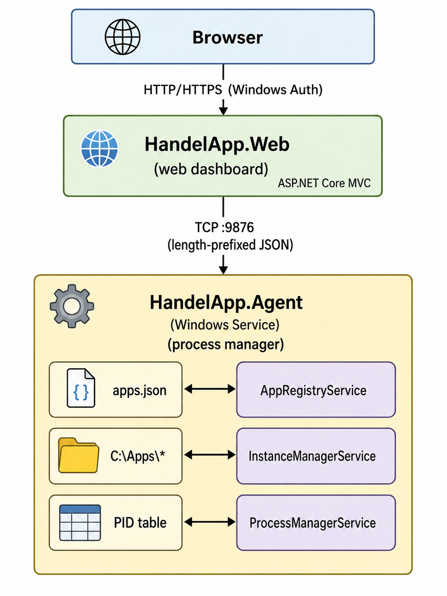

# HandelAppAgent

  

A distributed application management system for operations teams to register, start, stop, and monitor multiple console application instances via a web dashboard.

---

## Overview

HandelAppAgent bridges a Windows-hosted agent service and a browser-based control panel. The agent runs as a Windows Service, maintains a registry of deployed console applications, and manages their process lifecycles. The web dashboard connects to the agent over a persistent TCP connection using a custom length-prefixed JSON protocol, enabling operators to create and control numbered application instances without direct server access.

---

## Architecture



```text
 Browser
    |  HTTP/HTTPS (Windows Auth)
    v
+---------------------------------+
|   HandelApp.Web                 |  ASP.NET Core MVC
|   (web dashboard)               |
+----------------+----------------+
                 |  TCP :9876  (length-prefixed JSON)
                 v
+---------------------------------+
|   HandelApp.Agent               |  Windows Service
|   (process manager)             |
|                                 |
|  apps.json  <------------------->  AppRegistryService
|  C:\Apps\*  <------------------->  InstanceManagerService
|  PID table  <------------------->  ProcessManagerService
+---------------------------------+
```

**Wire protocol:** 4-byte big-endian length header + UTF-8 JSON body. Max message size: 64 KB.

---

## Project Structure

```text
HandelAppAgent/
|-- HandelApp.slnx                  # Solution file
|-- README.md                       # This file
+-- src/
    |-- HandelApp.Agent/            # Windows Service - agent process
    |   |-- Services/               # TcpCommandListener, ProcessManagerService, etc.
    |   |-- appsettings.json        # Agent configuration
    |   +-- apps.json               # Persisted app registry (runtime-generated)
    |-- HandelApp.Web/              # ASP.NET Core MVC dashboard
    |   |-- Controllers/            # AppsController, ConsoleAppController
    |   |-- Services/               # RemoteAgentService, AgentConnectionMonitor
    |   |-- Authorization/          # AdGroupHandler, AdGroupRequirement
    |   |-- Views/                  # Razor views (Apps, ConsoleApp, Home)
    |   +-- appsettings.json        # Web configuration
    +-- HandelApp.Shared/           # Shared between Agent and Web
        +-- Protocol/               # AgentCommand, AgentResponse, ProtocolSerializer, CommandType
```

---

## Design Patterns

### Creational

| Pattern | Location | Description |
|---------|----------|-------------|
| **Singleton** | `Program.cs` | `AppRegistryService`, `MultiAppManagerService` registered as single instances via `AddSingleton<T>()` |
| **Factory** | `ProcessManagerRegistry.cs` | `GetOrCreate()` lazily creates and caches one `ProcessManagerService` per instance name |
| **Builder** | `MultiAppManagerService.cs` | `BuildOptions()` constructs `ConsoleAppOptions` from an `AppDefinition` |

### Structural

| Pattern | Location | Description |
|---------|----------|-------------|
| **Facade** | `MultiAppManagerService.cs` | Single entry point over `AppRegistryService`, `ProcessManagerRegistry`, and `InstanceManagerService` |
| **Adapter** | `RemoteAgentService.cs` / `IRemoteAgentService.cs` | Adapts raw TCP stream + binary protocol to a typed `SendCommandAsync()` interface |
| **Proxy** | `RemoteAgentService.cs` | Controls access to the remote agent: manages connection state and transparent reconnection |
| **Decorator** | `ProcessManagerService.cs` | Wraps `System.Diagnostics.Process` with auto-reattach, graceful shutdown, and duplicate-process deduplication |

### Behavioral

| Pattern | Location | Description |
|---------|----------|-------------|
| **Command** | `AgentCommand.cs` + `TcpCommandListener.cs` | Requests encapsulated as `AgentCommand` objects; dispatched via `CommandType` switch |
| **Observer** | `ProcessManagerService.cs` | Subscribes to `Process.Exited` event to detect unexpected exits |
| **Template Method** | `TcpCommandListener.cs`, `AgentConnectionMonitor.cs`, `DefaultInstanceStartupService.cs` | All inherit `BackgroundService` and define their loop algorithm in `ExecuteAsync()` |

### Architectural

| Pattern | Location | Description |
|---------|----------|-------------|
| **Repository** | `AppRegistryService.cs` | Abstracts persistence of `AppDefinition` objects to `apps.json`; exposes `Register`, `Unregister`, `GetAll` |
| **Service Layer** | All `*Service.cs` files | Controllers and TCP handlers delegate all business logic to services |
| **MVC** | `HandelApp.Web` project | Controllers (`AppsController`, `ConsoleAppController`), view models, and Razor views |
| **Options Pattern** | `AgentOptions.cs`, `ConsoleAppOptions.cs`, `RemoteAgentOptions.cs` | Strongly-typed configuration bound from `appsettings.json` via `IOptions<T>` |

### Concurrency

| Pattern | Location | Description |
|---------|----------|-------------|
| **Monitor (Lock)** | `ProcessManagerService.cs`, `MultiAppManagerService.cs`, `ProcessManagerRegistry.cs` | `object _lock` + `lock` statement guards shared mutable state |
| **Semaphore** | `RemoteAgentService.cs` | `SemaphoreSlim(1,1)` serializes send/receive on the single TCP stream |
| **Reader-Writer Lock** | `AppRegistryService.cs` | `ReaderWriterLockSlim` allows concurrent reads; exclusive writes |
| **Double-Checked Locking** | `RemoteAgentService.cs` | Reads `volatile _isConnected` without acquiring semaphore; re-checks inside lock before connecting |
| **Fire-and-Forget** | `TcpCommandListener.cs` | `_ = HandleClientAsync(client, ct)` dispatches each client connection to a separate task |

---

## Prerequisites

- Windows Server 2016+ or Windows 10/11
- [.NET 8.0 SDK](https://dotnet.microsoft.com/download/dotnet/8.0) (build) or Runtime (deploy)
- Active Directory domain (required for Windows Authentication on the web app)
- Network access from the web server to the agent host on the configured TCP port

---

## Getting Started

### 1. Clone

```powershell
git clone <repo-url>
cd HandelAppAgent
```

### 2. Configure Agent

Edit `src/HandelApp.Agent/appsettings.json`:

```json
{
  "Agent": {
    "ListenPort": 9876,
    "BindAddress": "0.0.0.0",
    "AllowedClientIps": [],
    "MaxConcurrentConnections": 10
  },
  "ConsoleApp": {
    "WorkingDirectory": "C:\\Apps",
    "ShutdownGracePeriodMs": 10000,
    "DefaultInstancePath": "C:\\Apps\\Default",
    "InstancesRootPath": "C:\\Apps",
    "ExecutableName": "YourApp.exe"
  }
}
```

### 3. Configure Web

Edit `src/HandelApp.Web/appsettings.json`:

```json
{
  "RemoteAgent": {
    "Host": "127.0.0.1",
    "Port": 9876,
    "ConnectTimeoutSeconds": 5,
    "CommandTimeoutSeconds": 30,
    "ReconnectIntervalSeconds": 15
  },
  "Authorization": {
    "AllowedGroups": ["DOMAIN\\AppOps-Team"],
    "ReadOnlyGroups": ["DOMAIN\\AppMonitors"]
  }
}
```

### 4. Build

```powershell
dotnet build HandelApp.slnx
```

### 5. Run (development)

```powershell
# Terminal 1 - Agent
dotnet run --project src/HandelApp.Agent

# Terminal 2 - Web
dotnet run --project src/HandelApp.Web
```

Navigate to `https://localhost:<port>/Apps`.

---

## Configuration Reference

### Agent (`Agent` section)

| Key | Default | Description |
|-----|---------|-------------|
| `ListenPort` | `9876` | TCP port the agent listens on |
| `BindAddress` | `0.0.0.0` | Network interface to bind (`0.0.0.0` = all) |
| `AllowedClientIps` | `[]` | IP allowlist; empty array permits all clients |
| `MaxConcurrentConnections` | `10` | Max simultaneous web client connections |

### Agent (`ConsoleApp` section)

| Key | Default | Description |
|-----|---------|-------------|
| `WorkingDirectory` | `C:\Apps` | Root directory for application files |
| `ShutdownGracePeriodMs` | `10000` | Milliseconds to wait for graceful stop before force-kill |
| `DefaultInstancePath` | `C:\Apps\Default` | Folder for the default instance (auto-started on boot) |
| `InstancesRootPath` | `C:\Apps` | Root folder where numbered instances are created |
| `ExecutableName` | `HandelApp.exe` | Executable file name inside each instance folder |
| `InstanceNamePrefix` | `Instance` | Prefix for generated instance folder names |

### Web (`RemoteAgent` section)

| Key | Default | Description |
|-----|---------|-------------|
| `Host` | `127.0.0.1` | Hostname or IP of the agent |
| `Port` | `9876` | TCP port of the agent |
| `ConnectTimeoutSeconds` | `5` | TCP connection timeout |
| `CommandTimeoutSeconds` | `30` | Timeout waiting for a command response |
| `ReconnectIntervalSeconds` | `15` | Interval between reconnection attempts |

### Web (`Authorization` section)

| Key | Description |
|-----|-------------|
| `AllowedGroups` | AD groups with full read/write access |
| `ReadOnlyGroups` | AD groups with read-only (status) access |

---

## Supported Commands

| Command | Description |
|---------|-------------|
| `RegisterApp` | Register a new application definition |
| `UnregisterApp` | Remove a registered application |
| `ListApps` | List all registered applications |
| `CreateInstance` | Create a new numbered instance folder |
| `DeleteInstance` | Delete an existing instance folder |
| `ListInstances` | List all instances with running status |
| `Start` | Start a specific instance |
| `Stop` | Stop a running instance (graceful + force-kill fallback) |
| `Status` | Query running state and PID of an instance |

---

## Deployment

### Install Agent as Windows Service

```powershell
# Publish self-contained
dotnet publish src/HandelApp.Agent -c Release -r win-x64 --self-contained -o publish/agent

# Install service
sc.exe create "HandelApp Agent" binpath="C:\Deploy\agent\HandelApp.Agent.exe" start=auto

# Start service
sc.exe start "HandelApp Agent"
```

### Uninstall

```powershell
sc.exe stop "HandelApp Agent"
sc.exe delete "HandelApp Agent"
```

### Publish Web

```powershell
dotnet publish src/HandelApp.Web -c Release -o publish/web
# Deploy publish/web to IIS or any ASP.NET Core-compatible host
```

---

## Security

| Layer | Mechanism |
|-------|-----------|
| Web authentication | Windows Authentication (Negotiate - NTLM/Kerberos) |
| Web authorization | Active Directory group membership (`AllowedGroups`, `ReadOnlyGroups`) |
| Agent network access | IP allowlist (`Agent:AllowedClientIps`); empty = allow all |
| Path traversal | Instance folder paths validated against `InstancesRootPath` |
| Input validation | Regex allowlist on app IDs and instance names |
| CSRF protection | `[ValidateAntiForgeryToken]` on all mutating controller actions |

The agent does not perform its own authentication — restrict `AllowedClientIps` to trusted web server IPs in production.


---

## License

This project is proprietary. All rights reserved.
